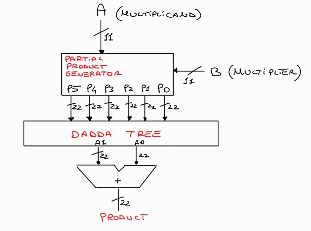

# Dadda Tree Multiplier and Floating Point Unit Simulation

This repository provides a comprehensive implementation and simulation environment for a Dadda tree multiplier and a floating-point unit (FPU). It includes source code, testbenches, simulation scripts, and detailed reports to understand and evaluate the architecture.

## Repository Structure

```
.
├── dadda_tree.jpg               # Visualization of the Dadda Tree structure
├── FP16.png                     # Diagram of FP16 floating-point representation
├── fpu_wave.png                 # Waveform from FPU simulation
├── mul_11_1_wave.png            # Waveform for standalone multiplier test (case 1)
├── mul_11_2_wave.png            # Waveform for standalone multiplier test (case 2)
├── mul_11_report.txt            # Text report summarizing multiplier test results
├── mul_schematic.jpg            # Schematic representation of the multiplier
├── report.pdf          	# Detailed project report
├── sim
│   ├── sim_fp.tcl               # Simulation script for testing the full FPU
│   └── sim_mul.tcl              # Simulation script for standalone multiplier
├── src
│   ├── cf_math_pkg.sv           # Package for mathematical constants and helper functions
│   ├── dadda_tree_11.sv         # Dadda tree implementation for 11-bit input
│   ├── fpnew_classifier.sv      # Operation classifier for the FPU
│   ├── fpnew_fma.sv             # Fused multiply-add unit logic
│   ├── fpnew_opgroup_block.sv   # Operational group block implementation
│   ├── fpnew_opgroup_fmt_slice.sv # Format slicing for grouped operations
│   ├── fpnew_pkg.sv             # Package for FPU definitions
│   ├── fpnew_rounding.sv        # Rounding mechanism for FPU
│   ├── fpnew_top.sv             # Top-level FPU module
│   ├── full_adder.sv            # Full adder implementation
│   ├── half_adder.sv            # Half adder implementation
│   ├── lzc.sv                   # Leading zero counter
│   ├── multiplier_11.sv         # Core logic for 11-bit multiplier
│   ├── multiplier.vhd           # Multiplier implementation in VHDL
│   ├── partial_gen_11.sv        # Partial product generator for 11-bit inputs
│   ├── partial_gen.vhd          # Partial product generator in VHDL
│   ├── registers.svh            # Register implementations
│   └── rr_arb_tree.sv           # Round-robin arbitration tree logic
├── tb
│   ├── clk_gen.vhd              # Clock generator module for testbench
│   ├── data_gen16.vhd           # Data generator for FP16 tests
│   ├── tb_fpnew_top_net.sv      # Post-synthesis testbench for FPU
│   ├── tb_fpnew_top_rtl.sv      # RTL-level testbench for FPU
│   └── tb_mul11.sv              # Testbench for the 11-bit multiplier
└── test_code.png                # Example input-output visualization
```

## Simulation Scripts

### `sim_mul.tcl`
This script tests the standalone Dadda tree multiplier. Key features:
- Verifies the multiplier against a wide range of test vectors.
- Outputs simulation waveforms to validate correctness.
- Generates a performance and accuracy report (`mul_11_report.txt`).

### `sim_fp.tcl`
This script tests the full FPU, which includes the Dadda tree multiplier as a core component. Features:
- Stimulates the FPU with IEEE FP16 formatted inputs.
- Verifies FPU operations like addition, subtraction, and multiplication.
- Produces detailed waveforms and simulation logs for analysis.

## Explanation of Key Components

### Dadda Tree Multiplier
The Dadda tree is an advanced hardware structure optimized for efficient multiplication. It accumulates and compresses partial products in stages, minimizing delay and hardware usage. 

#### Advantages:
1. **Hardware Efficiency**:
   - Uses the fewest possible compressor elements (half adders and full adders).
   - Saves resources while maintaining high performance.

2. **High Speed**:
   - Compresses partial products in a staged manner, reducing propagation delay.
   - Optimized for high-frequency operation compared to other tree-based designs.

3. **Scalable Design**:
   - Adapts to varying input sizes with tailored compression stages.
   - Suitable for large multipliers without significant area overhead.

4. **Low Power Consumption**:
   - Reduces switching activity by minimizing the number of adders.
   - Efficient for power-constrained applications.

#### Structure:

The top level of the Dadda tree multiplier consists of three main components:
1. **Partial Product Generator**: Generates intermediate products for the Dadda tree.
2. **Compression Tree**: Compresses partial products in stages to reduce height.
3. **Final Adder**: Performs the last addition to produce the final result.

A block scheme of the multiplier is shown below:



##### Partial Product Generator
- **Inputs**: Operands `A_in` and `B_in`.
- **Outputs**: Partial products (`P0`, `P1`, ..., `P5`) to feed the compression tree.
- Generates partial products using bitwise multiplication.
- Implements straightforward logic to produce rows of intermediate sums for the Dadda tree.

##### Compression Tree
- **Stages**: Compresses the partial products iteratively:
  - **Stage 1**: Combines initial partial products using half adders and full adders to reduce height.
  - **Stage 2**: Further compression to produce a two-row structure for final addition.
  - **Final Stage**: Outputs the reduced addends to the final adder.
- **Modules Used**:
  - `half_adder` and `full_adder` submodules for efficient bit-level addition.
  - Wires (`l1`, `l2`, `l3`) to manage intermediate results.

A block diagram of the Dadda tree multiplier is shown below:


##### Final Adder
- Takes the two-row output from the compression tree and performs final addition to produce the result.
- Implements straightforward logic for addition without carry propagation delays.

### Floating Point Unit (FPU)
The FPU integrates the Dadda tree multiplier to perform FP16 operations. It adheres to IEEE 754 standards and includes modules for rounding, classification, and fused multiply-add (FMA).

#### Features:
- Handles arithmetic operations with FP16 precision.
- Ensures compliance with floating-point standards.
- Optimized for area and speed.

## Visualization and Reports
- **Waveforms**: Simulation results are available as PNG images for quick visualization (`fpu_wave.png`, `mul_11_1_wave.png`, etc.).
- **Detailed Analysis**: The `Report (signed).pdf` file contains:
  - Timing and area analyses of the designs.
  - Comparative performance metrics across different synthesis strategies.

## Getting Started

### Prerequisites
- A SystemVerilog-compatible simulator (e.g., ModelSim, Synopsys VCS).
- Basic knowledge of hardware description languages and digital arithmetic.

### Running Simulations
1. **Standalone Multiplier**:
   - Navigate to the `sim` directory.
   - Execute `sim_mul.tcl` using your simulator.
   - View results in `mul_11_report.txt` and waveform files.

2. **Full FPU**:
   - Navigate to the `sim` directory.
   - Execute `sim_fp.tcl` using your simulator.
   - Analyze waveforms and logs for verification.

## Contributing
Contributions are welcome! If you have suggestions or improvements, feel free to submit a pull request or open an issue.

## License
This repository is licensed under the MIT License. See the `LICENSE` file for more details.
